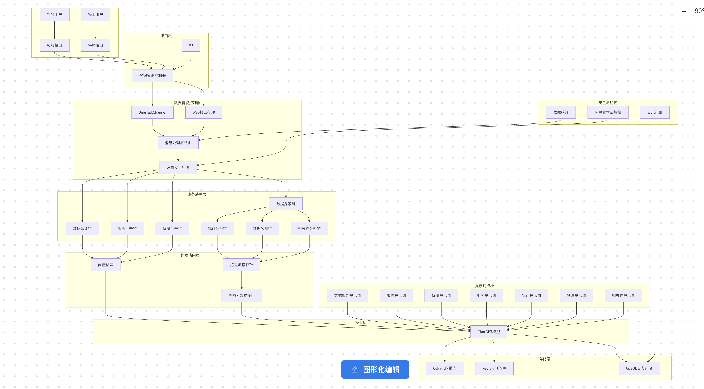

# 架构图
仅供参考，实际架构图以项目实际情况为准
 

# 功能
    %% 主要入口
    Client[客户端] --> |HTTP请求| Controller[数据智能控制器]
    DingTalk[钉钉] --> |Webhook| Controller
    
    %% 控制器层
    subgraph Controller[数据智能控制器 data_intelligence_controller.py]
        DingTalkEndpoint[/dingtalk接口/] --> DingTalkHandler[钉钉消息处理]
        BJXEndpoint[/talk_from_bjx接口/] --> BJXHandler[北极星对话处理]
        PermissionEndpoint[/permission接口/] --> PermissionHandler[权限校验]
        ChatListEndpoint[/get_chat_list接口/] --> ChatListHandler[聊天记录获取]
    end
    
    %% 业务处理层
    subgraph BusinessLayer[业务处理层]
        %% 通用智能问答
        IntelligenceChains[数据智能问答链data_intelligence_chains.py] --> |问题总结| SynopsisChain[问题总结链]
        IntelligenceChains --> |向量检索| VectorSearch[相似文档检索]
        IntelligenceChains --> |生成回答| QAChain[问答链]
        
        %% 报表问答
        ReportChains[报表问答链data_report_chains.py] --> |报表详情| ReportDetail[报表详情获取]
        ReportChains --> |报表问答| ReportQA[报表问答处理]
        
        %% 标签问答
        TagChains[标签问答链data_report_tag_chains.py] --> |标签查询| TagQuery[标签信息查询]
        TagChains --> |标签问答| TagQA[标签问答处理]
        
        %% 数据探索
        BusinessChains[数据探索链data_report_business_chains.py] --> |数据分析| DataAnalysis[数据分析处理]
        BusinessChains --> |统计分析| StatisticsAnalysis[统计分析]
        BusinessChains --> |相关性分析| RelevanceAnalysis[相关性分析]
        
        %% 预测分析
        ForecastChains[预测分析链data_report_forecast_chains.py] --> |数据预测| DataForecast[数据预测处理]
        ForecastChains --> |趋势分析| TrendAnalysis[趋势分析]
        
        %% 统计分析
        StatisticsChains[统计分析链data_report_statistics_chains.py] --> |数据统计| DataStatistics[数据统计处理]
        
        %% 相关性分析
        RelevanceChains[相关性分析链data_report_relevance_chains.py] --> |相关性计算| RelevanceCalculation[相关性计算]
    end
    
    %% 数据访问层
    subgraph DataAccessLayer[数据访问层]
        MysqlDao[mysql_dao.py] --> |日志记录| LogDB[(日志数据库)]
        MysqlDao --> |对话记录| TalkLogDB[(对话记录数据库)]
        ReportMysqlDao[report_mysql_dao.py] --> |权限查询| AuthorityDB[(权限数据库)]
        ReportMysqlDao --> |报表查询| ReportDB[(报表数据库)]
        GetReportData[get_report_data.py] --> |报表数据| ReportDataDB[(报表数据库)]
    end

