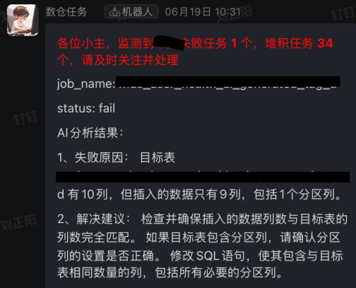

# dify+python+echarts可视化工作流
数据源支持：输入文本数据、上传excel文件、SQL查询数据库
可视化图形：折线图、柱状图、饼图、散点图、地图等20种
效果：(数据为虚假数据)
<!--   -->
<video src="../../image/aaa.mp4" controls></video>

 
 # 复杂数据解析小助手
 功能：输入数据事例，给出多种解析数据的SQL方式
 效果：
 

 # 数仓运维小助手
 功能：结合数仓报错日志，给出修改优化建议
 效果：
 

 # 以上内容仅供参考，实际工作场景内容比这多