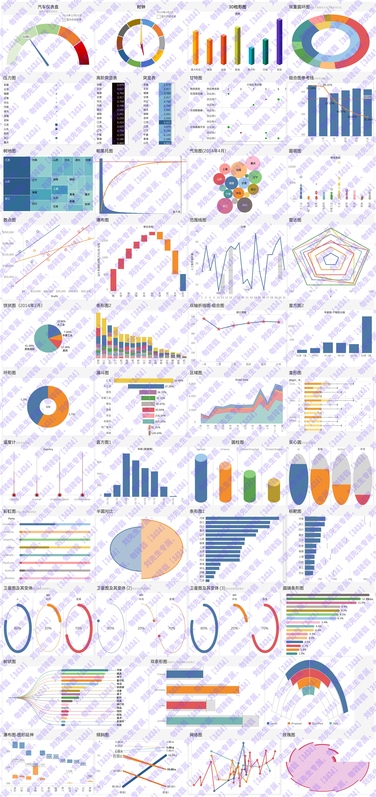
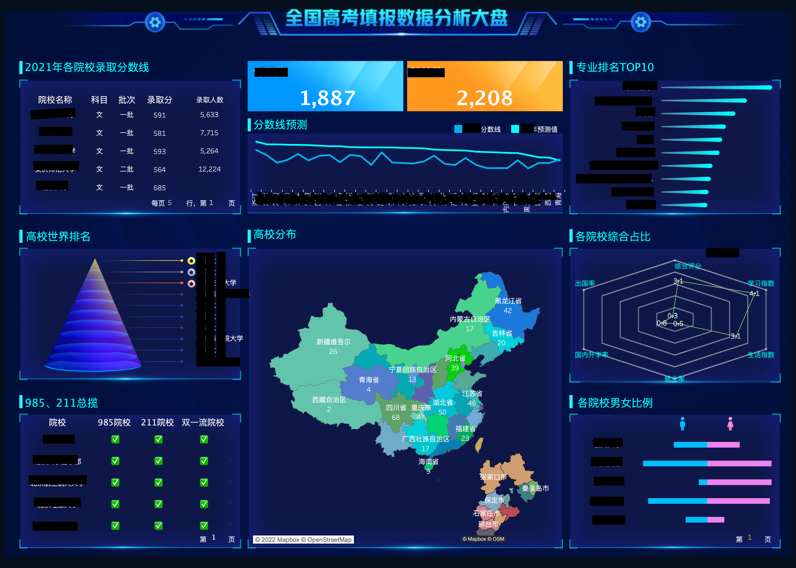

## 图表创建
1.条形图
2.折线图
3.饼图
4.地图
5.散布图
6.甘特图
7.气泡图
8.直方图
9.热点图
10.矩阵图
11.环形图
12.帕累托图
13.雷达图
14.阴影坡度图
15.桑基图
16.bump chart
17.柱形图和折线图的组合图
18.标靶图
19.漏斗图
20.男丁格尔玫瑰图
21.嵌套条形图
22.个性化背景
23.分类桑基图
24.瀑布图
25.饼图和折线的组合图
26.嵌套组合饼图
27.词云图
28.日历图
29.仪表盘
30.维恩图（两个维度）
31.维恩图（三个维度）
32.关系网
33.哑铃图
34.跑道图
35.蝴蝶图
36.环形进度图
37.倾斜图
38.盒须图
39.华夫饼图
40.马赛克图
41.气泡时间表
42.热力地图
43.花型射线图
44.四瓣花图
45.新年日历
46.四象限图
47.正态分布图
48.滑珠图
49.锥状柱形图
50.圆角条形图
51.蜂窝地图
52.烛台图
53.圆角标靶图
54.温度计
55.动态条形图
56.花瓣玫瑰图
57.3D效果的柱形图
58.圆径向图
59.旭日图
60.拱形图
61.箭头圆环进度图
62.容器满水图
63.流程图
64.自定义形状的圆环图
65.指针环形图
66.矩阵散点图
67.时间轴哑铃图
68.时间节点时间轴
69.分段条形图