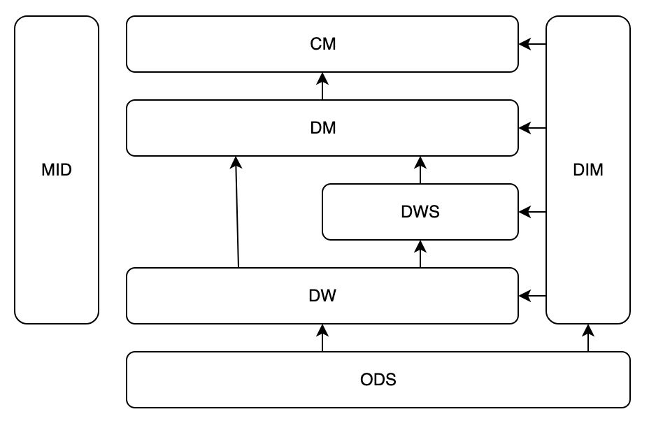

# 数仓模型分层规范

| 功能         | 命名规范                             | 命名示例                     | 粒度 | 是否跨数据域 | 是否跨业务过程 |
|------------|----------------------------------|--------------------------|------|-------------|----------------|
| ods        | 原始数据落地层，从数据源到ods不做任何处理           | ods_库.源表名                | - | 不跨 | 不跨 |
| dw         | 去除测试数据，翻译状态码，事实数据                | dw_数据域_业务过程块_业务描述        | 最细粒度 | 不跨 | 不跨 |
| dws        | 整合相似的业务过程                        | dws_数据域_业务过程块_主要维度       | 最细粒度 | 不跨 | 跨 |
| dm         | 聚合dw或dws，计算单数据域内指标               | dm_数据域_业务过程块_主要维度_(时间周期) | - | 不跨 | 跨 |
| cm         | 补全dm层维度，进一步聚合dm指标，关联同维度、跨数据域dm指标 | cm_部门_主要维度_(时间周期)        | - | 跨 | 跨 |
| dim公共维度    | 从ods出，去除测试数据，翻译状态码               | dim_维度_base              | - | 跨 | 跨 |
| dim数据域独有维度 | -                                | dim_维度_数据域               | - | 不跨 | 跨 |
| ads        | 上层应用层                            | ads_报表/标签/接口_数据内容        | - | 跨 | 跨 |
| tmp        | 中间临时表，可以在任一层                     | mid_数据域_业务过程块_主要维度       | - | 不跨 | 跨 |

# 数据仓库主题域与主题管理

## 一、核心
业务团队与数据团队存在核心诉求差异：
业务团队关注数据获取的效率与准确性，
数据团队关注数据管理的标准化与安全性。
主题域与数据域的划分是解决这一矛盾的关键设计，
其中数据域从业务视角划分，主题域从数据整合与分析视角重新归类。

## 二、主题域与主题的定义及划分
### （一）主题域
- **定义**：紧密相关的数据主题集合，基于业务分析需求抽象归类。
- **划分方法**：可按业务过程、业务部门或核心业务系统进行分类。

### （二）主题
- **核心定义**：从业务分析角度划分的核心业务领域或关注焦点，是数据整合与分析的基础单元。
- **设计原则**：以业务需求为导向，整合多源系统数据，服务分析需求。
- **关键作用**：指导数据建模（如星型/雪花模型）、规范数据存储结构、提升数据检索与分析效率。

## 三、主题域建设的核心价值
1. **架构与血缘清晰**：通过层级命名（如dwd_xxx、dws_xxx）明确数据层级与主题归属，血缘关系可追溯至源系统。
2. **数据统一性保障**：同一主题域数据源于单一业务系统，确保业务规则、主数据定义及逻辑的一致性。
3. **指标体系与复用性**：为跨层级指标（如转化率、时效）提供统一数据基础，支持模型跨层复用。
4. **管理高效性**：分层功能定位明确，治理责任绑定至业务系统负责人，提升管理落地效率。
5. **敏捷交付能力**：按业务系统优先级分步建设，降低实施风险，快速验证价值。

## 四、业务闭环验证
通过选取业务痛点（如某环节效率下降），结合主题域定位问题（如时效、操作等主题域），利用数据域原子事件分析根因，最终推动业务优化。验证过程可迭代调整主题域划分，确保设计与业务需求匹配。

总结：主题域与主题的划分是数据仓库建设的核心框架，通过“业务语言建模-模型反哺业务”的闭环，实现数据驱动业务发展的目标。